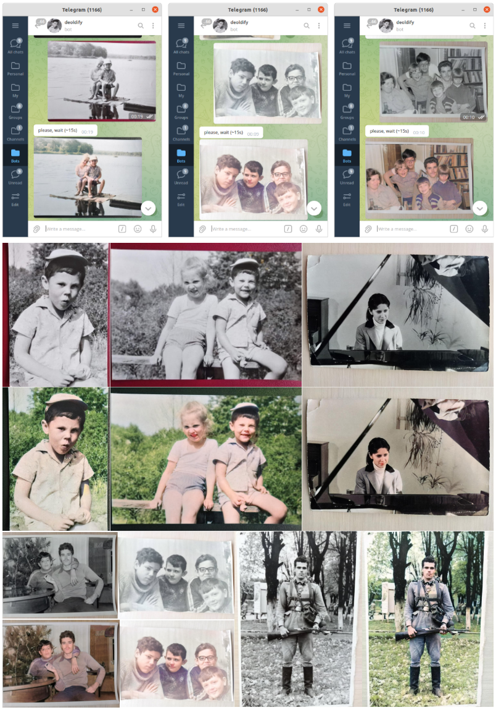

* [Demo (bot)](https://t.me/vaaliferov_deoldify_bot)
* [DeOldify (github)](https://github.com/jantic/DeOldify)

```bash
python3 -m venv env
source env/bin/activate
pip install -r requirements.txt
apt install -y git python3-opencv
git clone https://github.com/jantic/DeOldify.git DeOldify
cp -r DeOldify/deoldify DeOldify/fastai DeOldify/models ./
wget https://data.deepai.org/deoldify/ColorizeArtistic_gen.pth -P ./models
python3 bot.py <bot_owner_id> <bot_token>
```

